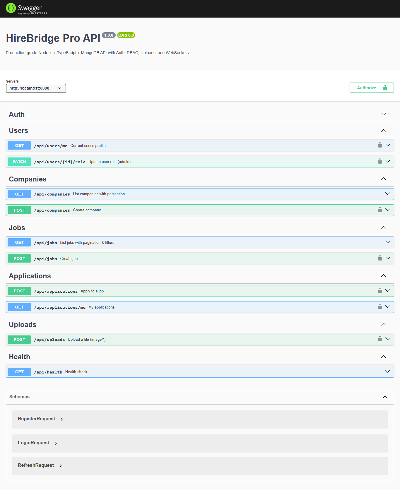

# HireBridge Pro Backend (Node 22 + TypeScript + MongoDB)  
[](https://github.com/USER/REPO/actions/workflows/ci.yml)  
 

من الآن فصاعدًا، هذا المشروع مُجهّز للعرض أمام الشركات: هيكل نظيف، أمان، RBAC، توثيق Swagger، اختبارات، وDocker.

---

## الميزات
- Node.js 22 + TypeScript (NodeNext)
- Express + Mongoose (MongoDB)
- JWT Auth (Access/Refresh) + RBAC (user|employer|admin)
- Helmet, CORS (من env), Rate Limiting, Request-Id
- Zod Validation
- Swagger UI على `/docs`
- رفع ملفات Multer + `/uploads`
- WebSockets (Socket.io)
- Pagination + Filtering + Sorting للوظائف والشركات
- Jest + Supertest + mongodb-memory-server
- Dockerfile + docker-compose
- CI (GitHub Actions)
- Seed script + Postman collection

---

## التشغيل محليًا
```bash
cp .env.local .env
npm install
npm run dev
# http://localhost:3000/docs
```

## عبر Docker
```bash
cp .env.docker .env
docker compose up -d --build
# http://localhost:3000/docs
```

## بناء وتشغيل إنتاج
```bash
npm run build
npm start
```

---

## اختبارات
```bash
npm test
```

---

## Seed
```bash
npm run seed
# Admin:    admin@example.com / secret123
# Employer: employer@example.com / secret123
# User:     ahmad@example.com / secret123
```

---

## أمثلة سريعة (curl)
```bash
# Register
curl -s -X POST http://localhost:3000/api/auth/register   -H "Content-Type: application/json"   -d '{"name":"Ahmad","email":"ahmad@example.com","password":"secret123"}'

# Login
curl -s -X POST http://localhost:3000/api/auth/login   -H "Content-Type: application/json"   -d '{"email":"ahmad@example.com","password":"secret123"}'

# Refresh (ضع refreshToken مكان placeholder)
curl -s -X POST http://localhost:3000/api/auth/refresh   -H "Content-Type: application/json"   -d '{"refreshToken":"<JWT_REFRESH_TOKEN>"}'
```

---

## Swagger
- افتح: `http://localhost:3000/docs`  
- **Tags**: Auth, Users, Companies, Jobs, Applications, Uploads, Health  
- يحتوي على أمثلة جاهزة وباراميترات التصفح (page/limit/sort) والبحث (q)

---

## Screenshots
بعد تشغيل السيرفر محليًا:
```bash
npm run dev
npm run snap:swagger  # يولّد docs/screenshots/swagger.png
```



---

## بنية المشروع
```
src/
  app.ts, index.ts, socket.ts
  config/ (config.ts, logger.ts)
  db/ (mongoose.ts, seed.ts)
  controllers/
  services/
  models/
  routes/
  middleware/
  utils/
  docs/swagger.json
tests/
postman/
```

---